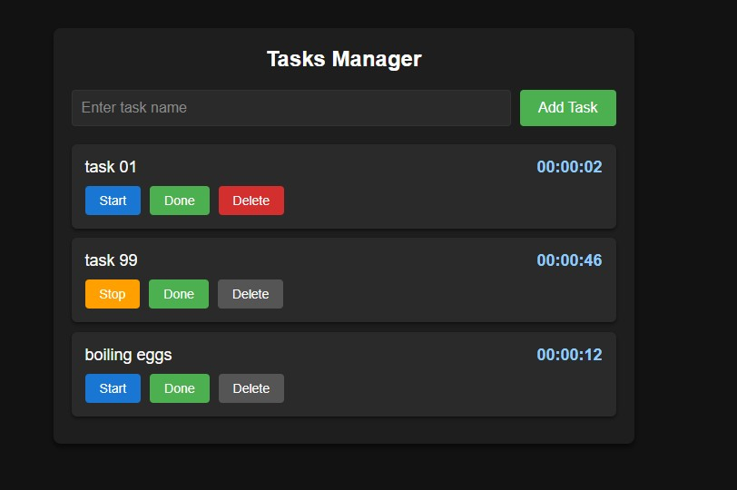

# Super Simple Task Manager

A (super) simple task manager app built with React, featuring a Node.js/Express backend (hosted on Render.com) and a frontend hosted on GitHub Pages.

## 🚀 Live Demo

[](https://marazmlab.github.io/Super-Simple-Task-Manager/)

&nbsp;

**Main features:**
- Add, edit, delete, and track time for tasks
- Data stored on a backend (Node.js/Express on Render.com)
- Clean, user-friendly interface
- Live synchronization with backend
- Option to run locally with json-server
- Responsive and modern UI

&nbsp;

## 🔶 Technologies


&nbsp;

## 🔶 Quick Start

### 1. Run locally (full CRUD)

```bash
git clone https://github.com/marazmlab/Super-Simple-Task-Manager.git
cd Super-Simple-Task-Manager
npm install
npm run json-server   # starts local backend on port 3001
npm start            # starts frontend on localhost
```

### 2. Online Demo

Frontend: [GitHub Pages](https://marazmlab.github.io/Super-Simple-Task-Manager/)
Backend: [Render.com API](https://super-simple-task-manager-backend.onrender.com/tasks)

### 3. Deploy to GitHub Pages

```bash
npm run deploy
```

&nbsp;

## 🔶 Solutions provided in the project

### Example: Fetching data while mounting component:

```jsx
// In TasksManager.js
componentDidMount() {
        fetch('https://super-simple-task-manager-backend.onrender.com/tasks')
            .then((response) => response.json())
            .then((tasks) => this.setState({tasks}));
        
        this.interval = setInterval(() => {
            this.setState((state) => {
                const updatedTasks = state.tasks.map((task) => {
                    if (task.isRunning) {
                        return {...task, time: task.time + 1};
                    }
                    return task;
                });
                return {tasks: updatedTasks};
            });
        }, 1000);
    }
```
This example showcases:
- **Controlled form:** The input field is controlled by React state for reliable data flow.
- **Task creation:** Submitting the form adds a new task to the list and backend.
- **Time tracking:** Each task can be started/paused, updating its timer in real time.
- **Task deletion:** Tasks can be removed from the list and backend with a single click.
- **Live sync:** All changes are immediately reflected in the UI and persisted via API calls.

&nbsp;

## 🔶 Conclusions

- **State management:** Uses React class components and state for predictable UI updates.
- **API integration:** All CRUD operations are performed via REST API (local json-server or remote Express backend).
- **Component structure:** The project demonstrates modular, reusable React components.
- **Styling:** Modern, responsive CSS for a clean look.
- **Persistence:** Tasks are always up-to-date thanks to backend synchronization.
- **Deployment:** The app is easy to run locally and share as a live demo via GitHub Pages and Render.com.

&nbsp;

## 🔶 Feel free to contact me

If you have any questions or feedback, feel free to reach out!  
Find me on [GitHub](https://github.com/marazmlab) or [LinkedIn](https://www.linkedin.com/in/belz/).

&nbsp;

## 🔶 Thanks / Special thanks / Credits

Thanks to my [Mentor - devmentor.pl](https://devmentor.pl/) – for providing me with this task and for code review.